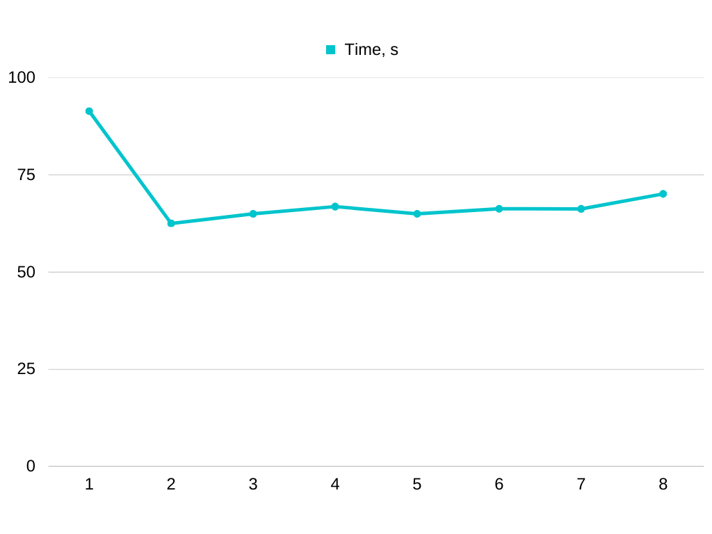

clang 16.0.6

Apple M1 (arm64, 8 cores)

test data:

```bash
python3 generate_game_field.py
```

compiled with:

```bash
mpic++ -std=c++17 main.cpp -o MPI
```

Задача масштабировалась лишь на 2 процесса. Добавление дополнительных процессов увеличивает user time, но реальное
время выполнения только растет. Не совсем понятно, с чем связан такой результат — возможно, это объясняется
особенностями архитектуры процессора или работы MPI под arm64.



```
1 processes:
       91.42 real        89.05 user         1.86 sys
2 processes:
       62.52 real       107.40 user         1.78 sys
3 processes:
       65.01 real       159.99 user         2.62 sys
4 processes:
       66.86 real       213.21 user         3.78 sys
5 processes:
       65.00 real       253.08 user         4.30 sys
6 processes:
       66.30 real       297.58 user         5.84 sys
7 processes:
       66.27 real       339.42 user         6.71 sys
8 processes:
       70.13 real       384.95 user         8.07 sys
```
